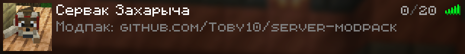

# Модпак для сервера Minecraft

**Что нового:**
- Перенос ванильных механик из новых версий игры (1.21.4-1.21.6)
- Новые предметы: шпатель, фотоаппарат и набор инструментов для него
- Улучшенные механики снега
- Моды взаимодействия игроков
- Существенные улучшения графики
- Улучшения интерфейса
- Обновления модов, чистка
- Исправления ошибок

[![Download button]][Download link]
  

### Установка:
1. Качаешь игру версии 1.21.1 Fabric 0.16.14+
2. Качаешь [актуальную версию модпака][Download link]
3. Распаковываешь с заменой файлы модпака в папку с игрой
  

### Справочная информация:
- [Список модов клиента](info/modlist.md)
- [Модификации сервера](info/server_modlist.md)
- [Полезные команды](info/server_commands.md)

<!---------------------------------[ Links ]---------------------------------->

[Download link]: https://github.com/Toby10/server-modpack/releases/download/v1.4/Server_Modpack_v1.4.zip
[Download button]: https://img.shields.io/badge/%D0%A1%D0%BA%D0%B0%D1%87%D0%B0%D1%82%D1%8C_%D0%BC%D0%BE%D0%B4%D0%BF%D0%B0%D0%BA-v1.4-gray?style=for-the-badge&labelColor=37a779
