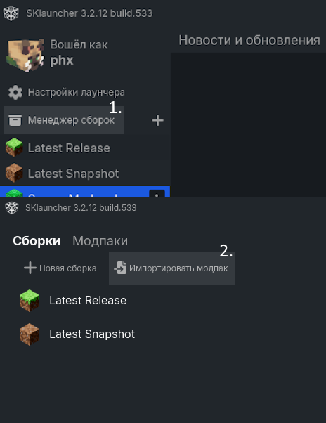

# Сборка модов для сервера Minecraft

**Что нового:**
- На карте сервера появились новые биомы
- Эндер мир перезапущен с новым [модом](https://modrinth.com/mod/enderscape)
- Новые виды мешков
- Медная воронка для фильтрации предметов
- Ручной аудиоплеер
- Улучшения звука и графики
- Полный актуальный [список модификаций](https://github.com/Toby10/server-modpack/blob/master/info/modlist.md)

[![Download button]][Release link]

**Также рекомендую скачать (по желанию):**
- [Панорамы для главного меню][HD Panoramas RP]
- [Фоны для окна загрузки мира][HD Loading BGs RP]
- [Axiom][Axiom release] (для креатива)
  

### Информация:
- Список модов ([перейти](info/modlist.md))
- Гайд по установке ([перейти](#установка))
- Гайд по обновлению ([перейти](#обновление))
- Идеология модпака ([перейти](#идеология-модпака))
  

### Установка.
Выбери подходящий тебе вариант:
- **TLauncher**: установи модпак [вручную](#ручная-установка).
- **Другой лаунчер**: импортируй [файл .mrpack][Modrinth link] в новую инстанцию.
- **Официальный клиент Mojang**: используй [Modrinth App](https://modrinth.com/app) и просто открой [файл .mrpack][Modrinth link].
  

### Требования для игры.
- Minecraft версии 1.21.1
- Fabric Loader 0.16.4 и выше
  

### Ручная установка.
1. Качаешь [полный архив][Release link] последней версии.
2. Создаёшь новый модпак, как на картинке:
> 

Инструкция для TLauncher (кликабельно)

>  
>     
> 
> 

3. (9) Переходишь по пути `.minecraft/versions/<имя_модпака>/`
4. Распаковываешь архив модпака в эту папку.
5. (10) Нажимаешь "Войти в игру", ждёшь установки и играешь.
  

### Обновление.
1. Чтобы не потерять свои настройки, **сохрани** отдельно:
    - файл options.txt
    - папку /config/voicechat
    - другие настройки модов, если ты что-то менял
    - настройки шейдеров по пути `/shaderpacks/<имя_шейдера>.zip.txt`, если менял
    - твои добавленные ресурс-паки из /resourcepacks

2. Перед обновлением следует **удалить**: 
    - папку /config
    - папку /mods
    - папку /resourcepacks (желательно)
    - папку /shaderpacks (не обязательно)
    - файл options.txt (желательно)

3. Перенеси содержимое архива с модпаком в папку с игрой.
4. После этого восстанови сохранённые ранее данные.
5. Проверь, что игра запускается и всё работает. Если что-то пошло не так, рекомендую установку начисто (без первого пункта).
  

### Идеология модпака.
Сделать игру более комфортной и расширить существующий геймплей без существенных модификаций.

#### Основные аспекты игры, на которые идёт упор в модпаке:
- Интерфейс, UX/UI дизайн
- Взаимодействие игроков (Role Play)
- Способы отрисовки, рендера
- Производительность
- Баги/недочёты/упущения игры

#### Мой контакт: [@antonov_kem](https://t.me/antonov_kem) 

<!---------------------------------[ Links ]---------------------------------->

[Release link]: https://github.com/Toby10/server-modpack/releases/download/v1.7/Server_Modpack_v1.7.zip
[Modrinth link]: https://github.com/Toby10/server-modpack/releases/download/v1.7/Server.Modpack.v1.7.mrpack
[Download button]: https://img.shields.io/badge/%D0%A1%D0%BA%D0%B0%D1%87%D0%B0%D1%82%D1%8C_%D0%B0%D1%80%D1%85%D0%B8%D0%B2-v1.7-gray?style=for-the-badge&labelColor=37a779
[HD Panoramas RP]: https://github.com/Toby10/server-modpack/releases/download/v1.6.1/HD.Panorama.Pack.zip
[HD Loading BGs RP]: https://github.com/Toby10/server-modpack/releases/download/v1.7/HD_Loading_Backgrounds.zip
[Axiom release]: https://cdn.modrinth.com/data/N6n5dqoA/versions/6BFd0w5s/Axiom-5.0.1-for-MC1.21.1.jar
